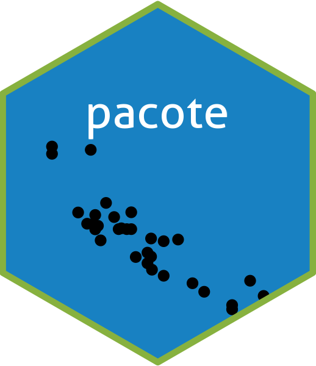

<!-- README.md is generated from README.Rmd. Please edit that file -->

```{r, include = FALSE}
knitr::opts_chunk$set(
  collapse = TRUE,
  comment = "#>",
  fig.path = "man/figures/README-",
  out.width = "100%"
)
```

# pacote 

<!-- badges: start -->
[](https://github.com/jstatlab/pacote/actions/workflows/R-CMD-check.yaml)
[](https://app.codecov.io/gh/jstatlab/pacote?branch=master)


[](https://lifecycle.r-lib.org/articles/stages.html#experimental)
[](https://doi.org/10.1016/j.rser.2023.113990)
[](https://orcid.org/0000-0001-7414-1154)
<!-- badges: end -->

O objetivo do pacote é construir um pacote básico na linguagem R.

## Instalação

Você pode instalar a versão em desenvolvimento do pacote a partir de [GitHub](https://github.com/) com:

```r
# install.packages("devtools")
devtools::install_github("jstatlab/pacote")
```
## Exemplo

Este é um exemplo básico que mostra as quatro operações básicas:

```{r example}
library(pacote)

# Somar
somar(60, 40)

# Subtrair
subtrair(90, 45)

# Multiplicar
multiplicar(0, 0)

# Dividir
dividir(144, 33)
```

What is special about using `README.Rmd` instead of just `README.md`? You can include R chunks like so:

```{r cars}
summary(cars)
```

You'll still need to render `README.Rmd` regularly, to keep `README.md` up-to-date. `devtools::build_readme()` is handy for this.

You can also embed plots, for example:

```{r pressure, echo = FALSE}
plot(pressure)
```

In that case, don't forget to commit and push the resulting figure files, so they display on GitHub and CRAN.
